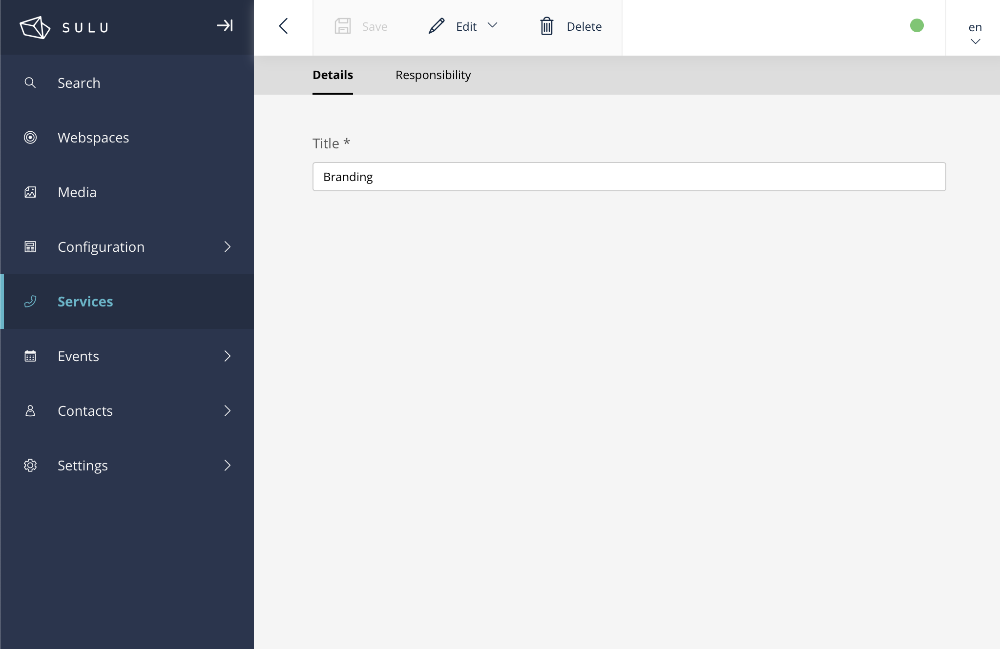
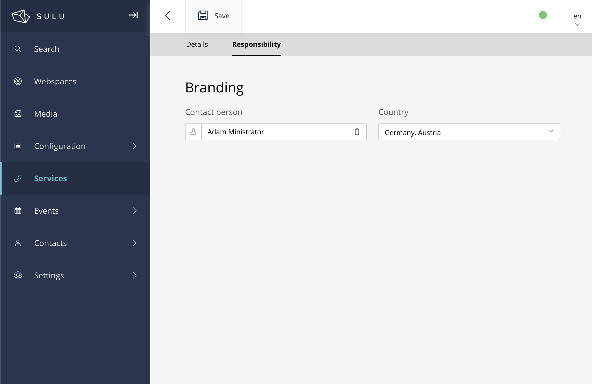

# SuluSnippetTabsBundle


The **Sulu Snippet Tabs Bundle** lets you easily add custom tabs to your snippets through a simple YAML configuration — no need to write custom admin extensions. This makes it straightforward to organize and extend your snippets with structured content.

<p style="display: flex; gap: 32px; justify-content: center;">
    <a href="docs/custom-tab.png" target="_blank">
        
    </a>
    <a href="docs/custom-tab-content.png" target="_blank">
        
    </a>
</p>

## 🚀 Features
- Add custom tabs to snippet forms
- Store additional structured data as extension content
- Configure tabs easily - no custom PHP code required
- Integrates with [Sulu Snippet Manager Bundle](https://github.com/perspeqtive/sulu-snippet-tabs-bundle)

## 🛠️ Installation
### Install the bundle via Composer:

```bash
composer require perspeqtive/sulu-snippet-tabs-bundle
```

### Enable the bundle

Register it in your config/bundles.php:

```php
return [
// ...
    PERSPEQTIVE\SuluSnippetTabsBundle\SuluSnippetTabsBundle::class => ['all' => true],
];
```

## 🛠️ Configuration
Create a configuration file at `config/packages/sulu_snippet_tabs.yaml`.
This defines which snippets will get extra tabs and in which order they appear in the Sulu Admin UI.

Example configuration:
```yaml
sulu_snippet_tabs:
    configuration:
        services:
            snippet_type: 'services'
            tabs:
                tools:
                    title: tools
                    form_key: services_tools
                    order: 20
                regions:
                    title: regions
                    form_key: services_regions
                    order: 30
            events:
                snippet_type: 'events'
                tabs:
                    locations:
                        title: locations
                        form_key: events_locations
                        order: 10
                    catering:
                        title: catering
                        form_key: events_catering
                        order: 20
```

### Configuration keys explained:
| config item       | required | Description                                                                                                     |
|:------------------|:--------:|:----------------------------------------------------------------------------------------------------------------|
| configuration     |   yes    | Root node for defining snippet tab configurations.                                                              |
| services / events |   yes    | You can define multiple snippet types (e.g. services, events). These are just keys for grouping.                |
| snippet_type      |   yes    | The technical name of the snippet type that should receive these tabs (must match your snippet template type).  |
| tabs              |   yes    | The grouping of the tabs for the selected snippet type                                                          |
| title             |   yes    | The label displayed in the admin UI for the tab.                                                                |
| form_key          |   yes    | The form key that links to a custom form definition (must exist in your form configurations).                   |
| order             |   yes    | Controls the sort order of the tabs. Lower numbers appear first.                                                |


## Create your custom forms
The form_key must reference a form configuration that you define, following the [Sulu Admin Tabs Cookbook](https://docs.sulu.io/en/2.5/cookbook/add-admin-tabs.html).

⚠️ **Important**: 
Properties inside the forms must use the naming pattern:

```
ext/{snippet_type}/{property_name}
```

For reference, see this example from the Sulu docs — note how the property names follow the ext/ convention:

```xml
<?xml version="1.0" ?>
<form xmlns="http://schemas.sulu.io/template/template"
    xmlns:xsi="http://www.w3.org/2001/XMLSchema-instance"
    xsi:schemaLocation="http://schemas.sulu.io/template/template http://schemas.sulu.io/template/form-1.0.xsd"
>
    <key>page_socials</key>

    <properties>
        <section name="twitter">
            <meta>
                <title lang="en">Twitter</title>
            </meta>
            <properties>
                <property name="ext/social/twitter_title" type="text_line">❗️
                    <meta>
                        <title lang="en">Twitter title</title>
                    </meta>
                </property>
                <property name="*ext/social/twitter_description*" type="text_line">❗️
                    <meta>
                        <title lang="en">Twitter description</title>
                    </meta>
                </property>
                <property name="ext/social/twitter_image" type="single_media_selection">❗
                    <meta>
                        <title lang="en">Twitter image</title>
                    </meta>
                    <params>
                        <param name="types" value="image"/>
                        <param name="formats" type="collection">
                            <param name="og_image" />
                        </param>
                    </params>
                </property>
            </properties>
        </section>
    </properties>
</form>
```
This ensures the data is correctly stored in your snippet’s `ext` field and is available in the output.

✅ **That’s it!** Once your configuration and forms are in place, the new tabs will automatically appear in the snippet edit view in the Sulu Admin.

## 👩‍🍳 Contribution

Please feel free to fork and extend existing or add new features and send a pull request with your changes! To establish a consistent code quality, please provide unit tests for all your changes and adapt the documentation.
